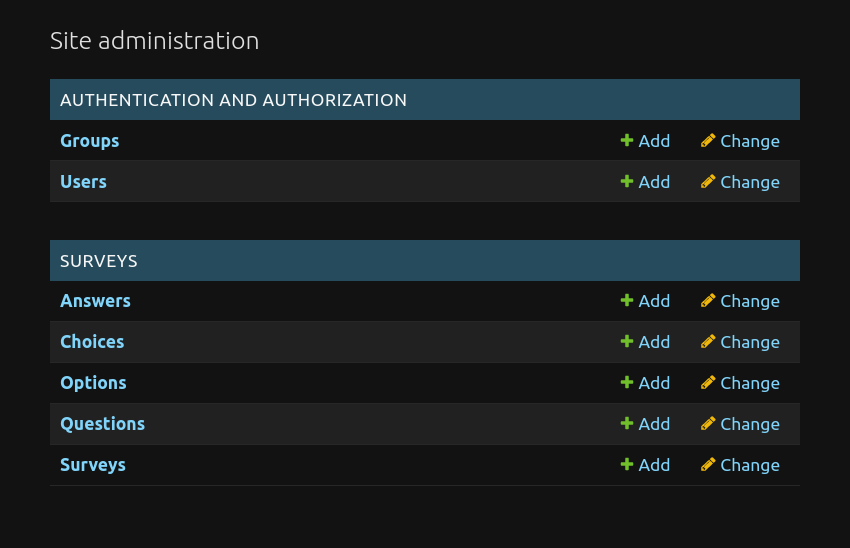
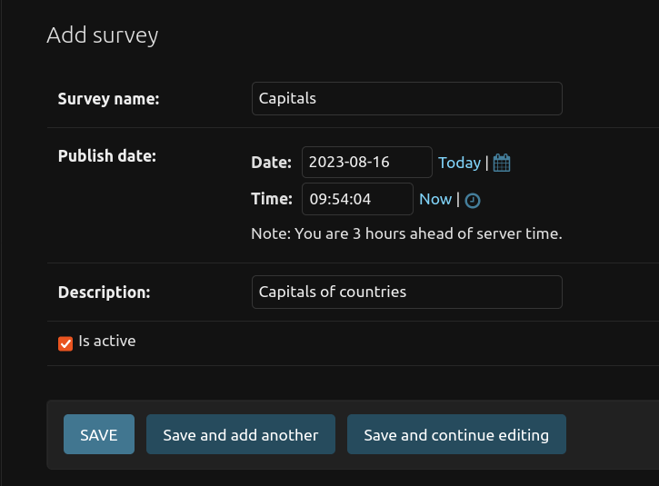
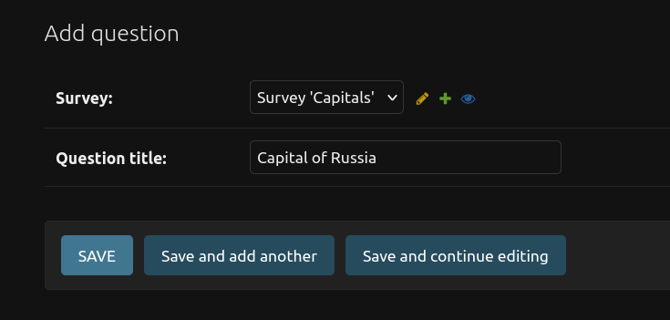
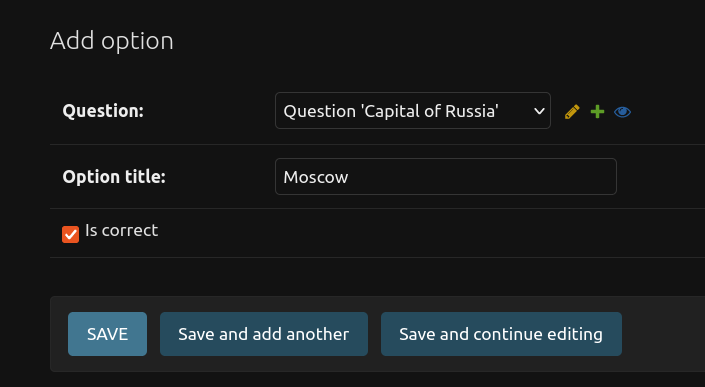
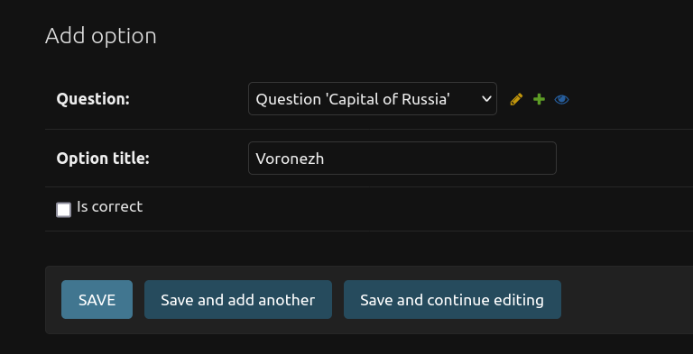
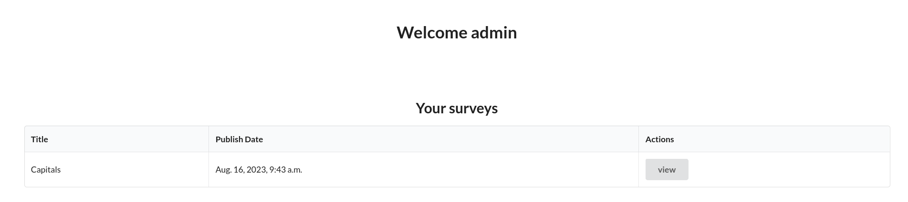

# Сервис проведения тестирования
Нужно сделать простой сервис проведения тестирования по каким-либо темам. Т.е.
есть вопросы с вариантами ответов, один или несколько вариантов должны быть
правильными. Вопросы группируются в наборы тестов, которые затем
пользователь может проходить и видеть свой результат.
Функциональные части сервиса:
- Регистрация пользователей
- Аутентификация пользователей
- Зарегистрированные пользователи могут
   - Проходить любой из тестовых наборов
      - Последовательный ответ на все вопросы(перескакивать через
вопросы или оставлять неотмеченными нельзя)
      - После завершения тестирования смотреть результат:
         - количество правильных/неправильных ответов
         - процент правильных ответов
- Админка. Стандартная админка Django. Разделы:
   - Стандартный раздел пользователей
   - Раздел с наборами тестов
      - Возможность на странице набора тестов добавлять
вопросы/ответы к вопросам/отмечать правильные ответы
      - Удаление вопросов/вариантов ответов/изменение правильных
решений при редактировании тестового набора

### Технологические требования:
- Код в репозитории на GitHub.
- Бэкенд - Python, Django
- Фронтенд - Vue. Интерфейс на усмотрение

## Установка
[comment]: # (Осуществляется переход на FastAPI. Установка на данный момент недоступна.)
[comment]: # (Задание оформлено в виде Docker-контейнера.)

Для начала скопируйте репозиторий и перейдите в папку с проектом:
```
git clone https://github.com/Jericho-kd/survey-service.git
cd survey-service
```

## Использование
Создайте виртуальное окружение:
```
python3 -m venv env
source env/bin/activate
```

Установите требуемые библиотеки:
```
pip install -r requirements.txt
```

Перейдите в папку src:
```
cd src/
```

Запустите следующие команды:
```
./manage.py migrate
./manage.py createsuperuser
./manage.py runserver
```
Перейдите по ссылке http://127.0.0.1:8000/admin/

Вы увидите следующую страницу



Для создание теста нажмите на кнопку Add рядом с надписью Survey

Вам надо ввести название теста и его описание 



После сохранения вернитесь на страницу с первого скриншота

Проделайте ту же операцию для создания вопросов



При создании вариантов ответов к вопросу не забудьте поставить галочку Is correct для варианта, который является верным!



Не ставьте галочку для неверного варианта



После этих шагов можно переходить к прохождению тестов на странице http://127.0.0.1:8000/surveys/

Выберите интересующий тест нажатием на кнопку view


## Тестирование
Находится в разработке